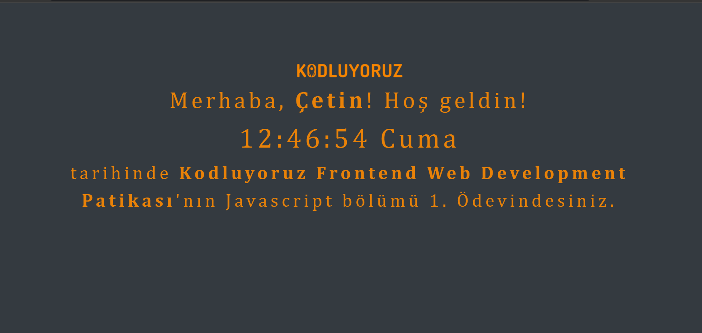

# Javascript Saat ve Karşılama

Bu repo [kodluyoruz](https://kodluyoruz.org/) Front-end eğitimde oluşturduğumuz Javascript ödev1 Javascript Saat ve Karşılama adı altında oluşturulmuş on yedinci repodur. İçerisinde bir adet README dosyası, bir adet de index.html, bir adet images klasörü, bir adet css klasörü, bir adet de js klasörü barındırıyor.

## Proje Görünümü

## Hesaplarım

Github [click](https://github.com/cetinyazici) !

LinkedIn [click](https://www.linkedin.com/in/cetinyazici/) !

Patika.dev [click](https://app.patika.dev/yazilimyazici) !
